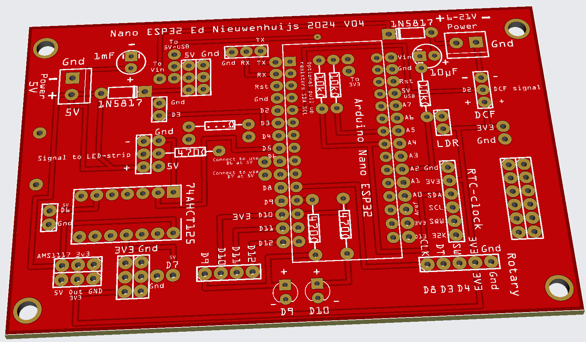

# ESP32 Communications template

(Readme is in progress. See here for complete reference: [Wordclock](https://github.com/ednieuw/Arduino-ESP32-Nano-Wordclock) )

A template sketch to:
- connect to WIFI, 
- get the date and time via NTP 
- store the time in an optional DS3231 RTC
- WPS to connect automatically with a router 
- OTA to upgrade the software 
- SoftAP page to enter credentials instead of using WPS
- DNS to see the BLE broadcast name given on the TAB of the web page 
- a HTML web page to use the menu
- BLE UART menu to use the menu from a phone, tablet or PC
- HTML serial monitor to see the serial output
- IR-remote control 
- rotary encoder or 
- keypad to control the microcontroller
- WS2812 RGB or SK6812 RGBW LED strips.
The sketch is developed on an Arduino Nano ESP32 which is a ESP32-S3.


This is a basic sketch for a ESP32 connected to:
- a LDR, 
- a rotary, 
- or keypad, 
- or IR-remote controler 
- and a DS3231 RTC-module. The DS3231 is for use when no WIFI is available and an accurate time in needed.

The sketch is a spin-off from the Arduino Nano ESP32 word clock. This sketch has been stripped from the word clock specifics and can be used for all kind of developments where WIFI, BLE, Serial input and output is needed.



With the small or a larger Fritzing PCB design, in this repository, PCB's [can be ordered from PCBway](https://www.pcbway.com) for less than €10. <br>
The PCB's are designed for an Arduino Nano ESP32.<br>
Fritzing design with Gerber files in this respority. 

The microcontroller can be controlled with 
- a BLE serial terminal program on your PC like the serial monitor of the Arduino IDE,
- a tablet or phone with a serial terminal app like: [BLE serial terminal](https://ednieuw.home.xs4all.nl/BLESerial/IOSappMain.html) or
- with a HTML page.

A software-enabled access point is created on your browser that can be accessed with the url: http://169.4.1.1 to set up and configure the WIFI SSID and password to your router through a smartphone or web browser.

There is also a WPS method that can be started with option Z in the menu.

With an Over the air (OTA) connection .bin software updates can be loaded. 

An unique Bluetooth station name given to the device in the menu of the device is also shown in your router.

Settings are stored permanently in the ESP32.

In Chrome it is possible to split a TAB to see the both the menu and the "Log view"


Start up logging in the Arduino IDE Serial monitor or start in your browser a web page with like 192.168.178.172 which you can find in the serial monitor or BLE serial terminal app or in your router.


```
Serial started
Stored settings loaded
LED strip started
Found I2C address: 0X57
Found I2C address: 0X68
External RTC module IS found
DS3231 RTC started
BLE started
Starting WIFI/NTP
[WiFi] WiFi is disconnected, will reconnect
WiFi lost connection.
[WiFi] WiFi is disconnected, will reconnect
Connected to access point
Connected to : FRITZ!BoxEd
Obtained IP address: 192.168.178.49
IP Address: 192.168.178.49
NTP is On and synced
___________________________________
I Menu, II long menu
K LDR reads/sec toggle On/Off
N Display off between Nhhhh (N2208)
R Reset settings
@ = Restart
___________________________________
Slope: 50     Min: 5     Max: 255 
BLE name: WordClock
IP-address: 192.168.178.49/update
WIFI=On NTP=On BLE=On FastBLE=Off
31/05/2025 15:55:31 
___________________________________
Web page started
WIFI started
31/05/2025 15:55:31
```


### Connect via Bluetooth
To make life easy it is preferred to use a phone or tablet and a Bluetooth communication app to enter the WIFI credentials into the clock.<br>

 	 	 
BLESerial nRF	BLE Serial Pro	Serial Bluetooth Terminal
- Download a Bluetooth UART serial terminal app on your phone, PC, or tablet.<br>

- For IOS iPhone or iPad (Buy this one to support me): [BLE Serial Pro](https://apps.apple.com/nl/app/ble-serial-pro/id1632245655?l=en). <br>
Or the free, less sophisticated app: [BLE serial nRF](https://apps.apple.com/nl/app/bleserial-nrf/id1632235163?l).<br>
Tip: Turn on Fast BLE with option + in the menu for a faster transmission.

- For Android use: [Serial Bluetooth terminal](https://play.google.com/store/apps/details?id=de.kai_morich.serial_bluetooth_terminal). <br>
Do not turn on Fast BLE in the menu. (Off = default)