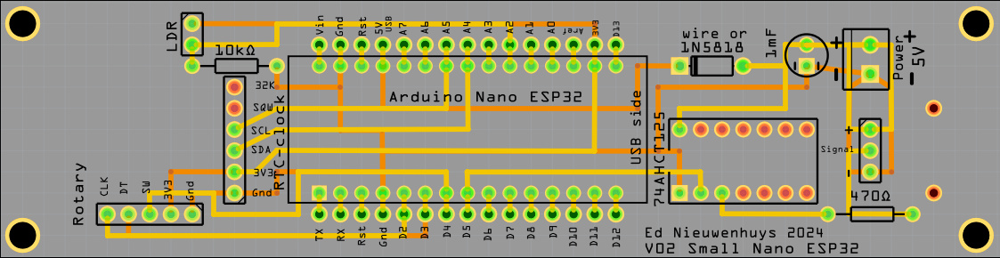

# ESP32 Communications template

(Readme is in progress. See here for complete reference: [Wordclock](https://github.com/ednieuw/Arduino-ESP32-Nano-Wordclock) )

A template sketch to:
- connect to WIFI 
- get the date and time via NTP 
- store time in an optional DS3231 RTC
- WPS to connect automatically to a router 
- OTA to upgrade the software 
- SoftAP page to enter credentials instead of using WPS
- DNS to see the BLE broadcast name given on the TAB of the web page 
- a HTML web page to operate the menu to control the ESP32
- a log view web page of a few Mb long
- BLE UART menu to use the menu from a phone, tablet or PC
- HTML serial monitor to see the serial output
- IR-remote control or
- rotary encoder or 
- keypad to control the microcontroller or
- BLE time sender iPhone app or BLE HTML webpage to send or set time and date
- a built-in BLE time sender function that sends time and date
- controls WS2812 RGB or SK6812 RGBW LED strips.
- Send time with the HC-12 SI4438 Wireless Serial Port Module - 433MHz 

The sketch is developed on an Arduino Nano ESP32 which is an ESP32-S3.<br>
The sketch can be used with other ESP32 boards. Change the pin numbers in the sketch for the specific board.



This is a basic sketch for a ESP32 connected to:
- a LDR, 
- a rotary, 
- or keypad, 
- or IR-remote controller 
- and a DS3231 RTC-module. The DS3231 is for use when no WIFI is available and an accurate time in needed.

The sketch is a spin-off from the Arduino Nano ESP32 word clock.<br>
This sketch has been stripped from the word clock specifics and can be used for all kind of developments where WIFI, BLE, Serial input and output is needed.


With the small or a larger Fritzing PCB design, in this repository, PCB's [can be ordered from PCBway](https://www.pcbway.com) for less than €10. <br>
The PCB's are designed for an Arduino Nano ESP32.<br>
Fritzing design with Gerber files in this repository. 

The microcontroller can be controlled with 
- a BLE serial terminal program on your PC like the serial monitor of the Arduino IDE.
- a BLE serial terminal program in a browser [HTML BLE serial terminal](https://github.com/ednieuw/HTML-BLEserial)
- a tablet or phone with a serial terminal app like: [BLE serial terminal](https://ednieuw.home.xs4all.nl/BLESerial/IOSappMain.html) or
- with a HTML page built in the sketch.

A software-enabled access point is created by the ESP32 that can be accessed in a browser with the url: http://169.4.1.1 to set up and configure the WIFI SSID and password to your router through a smartphone or web browser.

There is also a WPS method to set up a connection with the router that can be started with option Z in the menu.

With an Over the air (OTA) connection .bin software updates can be loaded. 

An unique Bluetooth station name, given to the device in the menu of the ESP32, is also shown in your router and can be used as an URL, like http://GivenName, to get the menu in a browser. .

Settings are stored permanently in the ESP32.

In some browsers like Chrome and Edge it is possible to split a TAB to see the both the menu and the "Log view"


Start up logging in the Arduino IDE Serial monitor or start in your browser a web page with like 192.168.178.172 which you can find in the serial monitor or BLE serial terminal app or in your router.


```
Serial started
Stored settings loaded
LED strip started
Found I2C address: 0X57
Found I2C address: 0X68
External RTC module IS found
DS3231 RTC started
BLE started
Starting WIFI/NTP
[WiFi] WiFi is disconnected, will reconnect
WiFi lost connection.
[WiFi] WiFi is disconnected, will reconnect
Connected to access point
Connected to : FRITZ!BoxEd
Obtained IP address: 192.168.178.49
IP Address: 192.168.178.49
NTP is On and synced
___________________________________
I Menu, II long menu
K LDR reads/sec toggle On/Off
N Display off between Nhhhh (N2208)
R Reset settings
@ = Restart
___________________________________
Slope: 50     Min: 5     Max: 255 
BLE name: WordClock
IP-address: 192.168.178.49/update
WIFI=On NTP=On BLE=On FastBLE=Off
31/05/2025 15:55:31 
___________________________________
Web page started
WIFI started
31/05/2025 15:55:31
```

The software can be used on this PCB: [small PCB](https://github.com/ednieuw/ESP32Communications/tree/main/PCBdesigns). <br>
Fritzing design with Gerber files in this repository.  
Five PCB's [can be ordered from **PCBway**](https://www.pcbway.com) for ~25€ / $. 


### Connect via Bluetooth
To make life easy it is preferred to use a phone or tablet and a Bluetooth communication app to enter the WIFI credentials into the clock.<br>

 	 	 
BLESerial nRF	BLE Serial Pro	Serial Bluetooth Terminal
- Download a Bluetooth UART serial terminal app on your phone, PC, or tablet.<br>

- For IOS iPhone or iPad (Buy this one to support me): [BLE Serial Pro](https://apps.apple.com/nl/app/ble-serial-pro/id1632245655?l=en). <br>
Or the free, less sophisticated app: [BLE serial nRF](https://apps.apple.com/nl/app/bleserial-nrf/id1632235163?l).<br>
Tip: Turn on Fast BLE with option + in the menu for a faster transmission.

- For Android use: [Serial Bluetooth terminal](https://play.google.com/store/apps/details?id=de.kai_morich.serial_bluetooth_terminal). <br>
Do not turn on Fast BLE in the menu. (Off = default)


Enter the SSID name and password of your router prefixed with A for the SSID and with B for the password.
- `aSSIDname` and press Send
- `bPassword` and press Send

Optionally:
- `cDevicename` and press Send

The device name is the name displayed in the WIFI-router and in the list of Bluetooth devices in the BLE serial terminal app.

# Before starting

The device receives time from the internet when connected to a router.

When a DS3231 time module is attached to the circuit board an internet connection is not required. Select in the menu that the DS3231 is used instead of the NTP time (J Toggle use DS3231 RTC module).

### Connect to WIFI
The name of the WIFI-station and password has to be entered once. These credentials will be stored in memory of the microprocessor.

If the sketch is started without a SSID it will start a WIFI access point you can connect to.
- Open in your phone, tablet or PC the WIFI connections. In the list of WIFI stations there will be one named: **StartWordClock**.
- Connect to it and enter the password: `12345678`
- Enter the SSID and password of your WIFI router. These credentials can often be found at the bottom of your router.
- When Submit is pressed the ESP32 will restart and connect to the internet.

There is also a WPS method to set up a connection with the router that can be started with option **Z** in the menu.

# Control of the device

If the device is connected to the internet it will seek contact with a time server (NTP connection can be turned off in the menu).

The time zone is set to UTC+1 Amsterdam but can be changed in the menu.

There are a few methods to control the device:

1. Connect the MCU with a serial cable to a PC and use a serial terminal. Sending the character `I` for information will display the menu followed with the actual settings.

2. Use the BLE connection with a UART serial terminal app on your mobile phone or tablet. Start the app, find the device in the list and connect. Send `I` to display the menu.

3. Enter the IP-address shown in the serial monitor in the browser of your mobile or PC (for example: `192.168.178.49`).

If the BLE beacon name of the device is `wordclock` (see menu → BLE name: wordclock), you can enter `wordclock.local` as URL in the browser instead.
If this does not work install host software:
- For Linux, install Avahi (http://avahi.org/).
- For Windows, install Bonjour (http://www.apple.com/support/bonjour/).
- For Mac OSX and iOS support is built in through Bonjour already.

## Detailed description

With the menu many preferences can be set. These preferences are permanently stored in the Arduino Nano ESP32 storage space.

Enter the first character in the menu of the item to be changed followed with the parameter. For most entries upper and lower case are identical.

### A SSID, B Password, C BLE beacon name
Change the name of the SSID of the router to be connected to.<br>
`aFRITZ!Box` or `AFRITZ!Box`<br>
Then enter the password. For example: `BSecret_pass`<br>
and `cMydevice` as a name of the BLE beacon that will be shown in your phone. (default after a reset: wordclock)<br>
Restart the MCU by sending `@`.

### CCC
Entering `CCC` or `ccc` will toggle BLE on or off. Be careful turning it off. When BLE is off the device can only be controlled with WIFI or the USB serial port.

### D Set Date and T Set Time
If not connected to WIFI and no DS3231 RTC is attached, date and time must be set by hand.<br>
For example enter: `D06112022` to set the date to 6 November 2022.<br>
Enter for example `T132145` (or `132145`, or `t132145`) to set time to 13:21:45.

### E Set Timezone
At the bottom of this page you can find the time zones.<br>
For Central Europe the string is: `CET-1CEST,M3.5.0,M10.5.0/3`<br>
Send it starting with an 'E' or 'e' in front: `ECET-1CEST,M3.5.0,M10.5.0/3`<br>
Entering `RRR` will reset the timezone to Amsterdam CET. You will also lose your stored SSID and password with this reset.

### G Scan WIFI networks
Scan available Wi-Fi networks and print the SSIDs found. This option does not work from the menu web page.

### H H01 rotary encoder, H02 buttons, H03/04 remote, H05 time receiver
H01 Rotary encoder<br>
H02 Keypad<br>
H03 Large IR-remote with numeric UP DOWN LEFT RIGHT ON/OFF and POWER<br>
H04 Tiny IR-remote with six buttons<br>
H05 Turn On/Off the BLE time receiver.<br> 
When enabled, the device listens for time sent by a BLE time sender app running on a nearby phone or PC and uses that to set its clock.<br>
Compatible senders:
- HTML BLE time sender (Chrome/Edge): [HTML-BLEserial](https://github.com/ednieuw/HTML-BLEserial)
- iOS BLE time sender app: [BLEtimeSender](https://ednieuw.nl/BLESerial/BLEtimeSender.html)

### Q BLE Time sender On/Off
Toggles the built-in BLE time sender. When On, the ESP32 broadcasts the current time and date over BLE every minute so nearby devices with H05 enabled can sync to it. Turning the time sender On automatically turns the time receiver (H05) Off.

### U HC-12 time sender On/Off
Toggles the HC-12 SI4438 433MHz wireless serial time sender. When On, the current time is transmitted via the HC-12 module so other devices in range can receive and sync to it.

### } Learn IR remote
Start learning the keys of a new infrared remote.

### I short menu, II long menu
`i` prints the short info menu.<br>
`ii` prints the extended menu (long help).

### J DS3231 RTC module On/Off
When DS3231 is enabled, NTP may be turned off. Use option `X` to toggle NTP if needed.

### K LDR reads/sec toggle On/Off
Prints the LDR-readings and the calculated intensity output.<br>
K1 Turn On and Off the display of time every minute.<br>
K2 Turn On and Off the display of time every hour.

### N Display off between Nhhhh (N2208)
With `N2208` the display will be turned off between 22:00 and 08:00.

### O Display toggle On/Off
Toggles the display off and on.

### P Status LED toggle On/Off
Toggle status LEDs on the board On/Off.

### R Reset settings
`R` will set all preferences to default settings. The SSID and password, timezone and rotary/IR usage will be kept.<br>
`RRR` will clear SSID, password, set time zone to Amsterdam (CET-1) and turn WIFI, NTP and BLE on.<br>
`RRRRR` is a total reset.

### S Slope, L Min, M Max (S50 L5 M200)
Three parameters to control the light intensity of the LED strip. The values range between 0 and 255.<br>
The minimum light intensity prevents the LEDs from turning completely off when it is dark.<br>
The Slope (sensitivity) controls the speed at which the maximum value is reached.

### W=WIFI, X=NTP, Z=WPS
Toggle WIFI and NTP on and off. Z starts the WPS procedure to connect to a router.

### + Fast BLE
The BLE UART protocol sends default packets of 20 bytes with a delay of 50 ms between packets.<br>
The iOS BLEserial app is able to receive packets of 80 bytes or more. Option `+` toggles between long and short packages.

### @ = Restart MCU
`@` will restart the MCU. Settings will not be deleted.

### ! = Show all clock times
`!` prints the current NTP time, internal RTC time and DS3231 time side by side — useful to verify that all clocks are in sync without triggering an update.

### & = Get and store NTP time in RTC and DS3231
`&` will get the NTP time immediately from the internet and store it in the RTC clocks.

# How to compile

At the moment of writing (June 2026) the Espressif ESP32 board core V3.3.9 with the Arduino Nano ESP32 selected compiles to a working program.

Select the Nano ESP32 board from Arduino in the Arduino IDE.


There are two compiler pin numbering methods: One uses the GPIO pin numbering of the ESP32-S3 and the other Arduino pin numbering. This code works with GPIO pin numbering selected.

Install the Arduino Nano ESP32 board and use these settings:
```
Board: Arduino Nano ESP32
Partition Scheme: With FAT
Pin Numbering: By GPIO number (legacy)  !! use this when using Neopixel
```

# Time zones

Copy the text between the quotes and paste it after the character `E` to set your time zone.

<pre>
 Africa/Abidjan,"GMT0"
 Africa/Accra,"GMT0"
 Africa/Addis_Ababa,"EAT-3"
 Africa/Algiers,"CET-1"
 Africa/Asmara,"EAT-3"
 Africa/Bamako,"GMT0"
 Africa/Bangui,"WAT-1"
 Africa/Banjul,"GMT0"
 Africa/Bissau,"GMT0"
 Africa/Blantyre,"CAT-2"
 Africa/Brazzaville,"WAT-1"
 Africa/Bujumbura,"CAT-2"
 Africa/Cairo,"EET-2"
 Africa/Casablanca,"&lt;+01&gt;-1"
 Africa/Ceuta,"CET-1CEST,M3.5.0,M10.5.0/3"
 Africa/Conakry,"GMT0"
 Africa/Dakar,"GMT0"
 Africa/Dar_es_Salaam,"EAT-3"
 Africa/Djibouti,"EAT-3"
 Africa/Douala,"WAT-1"
 Africa/El_Aaiun,"&lt;+01&gt;-1"
 Africa/Freetown,"GMT0"
 Africa/Gaborone,"CAT-2"
 Africa/Harare,"CAT-2"
 Africa/Johannesburg,"SAST-2"
 Africa/Juba,"CAT-2"
 Africa/Kampala,"EAT-3"
 Africa/Khartoum,"CAT-2"
 Africa/Kigali,"CAT-2"
 Africa/Kinshasa,"WAT-1"
 Africa/Lagos,"WAT-1"
 Africa/Libreville,"WAT-1"
 Africa/Lome,"GMT0"
 Africa/Luanda,"WAT-1"
 Africa/Lubumbashi,"CAT-2"
 Africa/Lusaka,"CAT-2"
 Africa/Malabo,"WAT-1"
 Africa/Maputo,"CAT-2"
 Africa/Maseru,"SAST-2"
 Africa/Mbabane,"SAST-2"
 Africa/Mogadishu,"EAT-3"
 Africa/Monrovia,"GMT0"
 Africa/Nairobi,"EAT-3"
 Africa/Ndjamena,"WAT-1"
 Africa/Niamey,"WAT-1"
 Africa/Nouakchott,"GMT0"
 Africa/Ouagadougou,"GMT0"
 Africa/Porto-Novo,"WAT-1"
 Africa/Sao_Tome,"GMT0"
 Africa/Tripoli,"EET-2"
 Africa/Tunis,"CET-1"
 Africa/Windhoek,"CAT-2"
 America/Adak,"HST10HDT,M3.2.0,M11.1.0"
 America/Anchorage,"AKST9AKDT,M3.2.0,M11.1.0"
 America/Anguilla,"AST4"
 America/Antigua,"AST4"
 America/Araguaina,"&lt;-03&gt;3"
 America/Argentina/Buenos_Aires,"&lt;-03&gt;3"
 America/Argentina/Catamarca,"&lt;-03&gt;3"
 America/Argentina/Cordoba,"&lt;-03&gt;3"
 America/Argentina/Jujuy,"&lt;-03&gt;3"
 America/Argentina/La_Rioja,"&lt;-03&gt;3"
 America/Argentina/Mendoza,"&lt;-03&gt;3"
 America/Argentina/Rio_Gallegos,"&lt;-03&gt;3"
 America/Argentina/Salta,"&lt;-03&gt;3"
 America/Argentina/San_Juan,"&lt;-03&gt;3"
 America/Argentina/San_Luis,"&lt;-03&gt;3"
 America/Argentina/Tucuman,"&lt;-03&gt;3"
 America/Argentina/Ushuaia,"&lt;-03&gt;3"
 America/Aruba,"AST4"
 America/Asuncion,"&lt;-04&gt;4&lt;-03&gt;,M10.1.0/0,M3.4.0/0"
 America/Atikokan,"EST5"
 America/Bahia,"&lt;-03&gt;3"
 America/Bahia_Banderas,"CST6CDT,M4.1.0,M10.5.0"
 America/Barbados,"AST4"
 America/Belem,"&lt;-03&gt;3"
 America/Belize,"CST6"
 America/Blanc-Sablon,"AST4"
 America/Boa_Vista,"&lt;-04&gt;4"
 America/Bogota,"&lt;-05&gt;5"
 America/Boise,"MST7MDT,M3.2.0,M11.1.0"
 America/Cambridge_Bay,"MST7MDT,M3.2.0,M11.1.0"
 America/Campo_Grande,"&lt;-04&gt;4"
 America/Cancun,"EST5"
 America/Caracas,"&lt;-04&gt;4"
 America/Cayenne,"&lt;-03&gt;3"
 America/Cayman,"EST5"
 America/Chicago,"CST6CDT,M3.2.0,M11.1.0"
 America/Chihuahua,"MST7MDT,M4.1.0,M10.5.0"
 America/Costa_Rica,"CST6"
 America/Creston,"MST7"
 America/Cuiaba,"&lt;-04&gt;4"
 America/Curacao,"AST4"
 America/Danmarkshavn,"GMT0"
 America/Dawson,"MST7"
 America/Dawson_Creek,"MST7"
 America/Denver,"MST7MDT,M3.2.0,M11.1.0"
 America/Detroit,"EST5EDT,M3.2.0,M11.1.0"
 America/Dominica,"AST4"
 America/Edmonton,"MST7MDT,M3.2.0,M11.1.0"
 America/Eirunepe,"&lt;-05&gt;5"
 America/El_Salvador,"CST6"
 America/Fortaleza,"&lt;-03&gt;3"
 America/Fort_Nelson,"MST7"
 America/Glace_Bay,"AST4ADT,M3.2.0,M11.1.0"
 America/Godthab,"&lt;-03&gt;3&lt;-02&gt;,M3.5.0/-2,M10.5.0/-1"
 America/Goose_Bay,"AST4ADT,M3.2.0,M11.1.0"
 America/Grand_Turk,"EST5EDT,M3.2.0,M11.1.0"
 America/Grenada,"AST4"
 America/Guadeloupe,"AST4"
 America/Guatemala,"CST6"
 America/Guayaquil,"&lt;-05&gt;5"
 America/Guyana,"&lt;-04&gt;4"
 America/Halifax,"AST4ADT,M3.2.0,M11.1.0"
 America/Havana,"CST5CDT,M3.2.0/0,M11.1.0/1"
 America/Hermosillo,"MST7"
 America/Indiana/Indianapolis,"EST5EDT,M3.2.0,M11.1.0"
 America/Indiana/Knox,"CST6CDT,M3.2.0,M11.1.0"
 America/Indiana/Marengo,"EST5EDT,M3.2.0,M11.1.0"
 America/Indiana/Petersburg,"EST5EDT,M3.2.0,M11.1.0"
 America/Indiana/Tell_City,"CST6CDT,M3.2.0,M11.1.0"
 America/Indiana/Vevay,"EST5EDT,M3.2.0,M11.1.0"
 America/Indiana/Vincennes,"EST5EDT,M3.2.0,M11.1.0"
 America/Indiana/Winamac,"EST5EDT,M3.2.0,M11.1.0"
 America/Inuvik,"MST7MDT,M3.2.0,M11.1.0"
 America/Iqaluit,"EST5EDT,M3.2.0,M11.1.0"
 America/Jamaica,"EST5"
 America/Juneau,"AKST9AKDT,M3.2.0,M11.1.0"
 America/Kentucky/Louisville,"EST5EDT,M3.2.0,M11.1.0"
 America/Kentucky/Monticello,"EST5EDT,M3.2.0,M11.1.0"
 America/Kralendijk,"AST4"
 America/La_Paz,"&lt;-04&gt;4"
 America/Lima,"&lt;-05&gt;5"
 America/Los_Angeles,"PST8PDT,M3.2.0,M11.1.0"
 America/Lower_Princes,"AST4"
 America/Maceio,"&lt;-03&gt;3"
 America/Managua,"CST6"
 America/Manaus,"&lt;-04&gt;4"
 America/Marigot,"AST4"
 America/Martinique,"AST4"
 America/Matamoros,"CST6CDT,M3.2.0,M11.1.0"
 America/Mazatlan,"MST7MDT,M4.1.0,M10.5.0"
 America/Menominee,"CST6CDT,M3.2.0,M11.1.0"
 America/Merida,"CST6CDT,M4.1.0,M10.5.0"
 America/Metlakatla,"AKST9AKDT,M3.2.0,M11.1.0"
 America/Mexico_City,"CST6CDT,M4.1.0,M10.5.0"
 America/Miquelon,"&lt;-03&gt;3&lt;-02&gt;,M3.2.0,M11.1.0"
 America/Moncton,"AST4ADT,M3.2.0,M11.1.0"
 America/Monterrey,"CST6CDT,M4.1.0,M10.5.0"
 America/Montevideo,"&lt;-03&gt;3"
 America/Montreal,"EST5EDT,M3.2.0,M11.1.0"
 America/Montserrat,"AST4"
 America/Nassau,"EST5EDT,M3.2.0,M11.1.0"
 America/New_York,"EST5EDT,M3.2.0,M11.1.0"
 America/Nipigon,"EST5EDT,M3.2.0,M11.1.0"
 America/Nome,"AKST9AKDT,M3.2.0,M11.1.0"
 America/Noronha,"&lt;-02&gt;2"
 America/North_Dakota/Beulah,"CST6CDT,M3.2.0,M11.1.0"
 America/North_Dakota/Center,"CST6CDT,M3.2.0,M11.1.0"
 America/North_Dakota/New_Salem,"CST6CDT,M3.2.0,M11.1.0"
 America/Nuuk,"&lt;-03&gt;3&lt;-02&gt;,M3.5.0/-2,M10.5.0/-1"
 America/Ojinaga,"MST7MDT,M3.2.0,M11.1.0"
 America/Panama,"EST5"
 America/Pangnirtung,"EST5EDT,M3.2.0,M11.1.0"
 America/Paramaribo,"&lt;-03&gt;3"
 America/Phoenix,"MST7"
 America/Port-au-Prince,"EST5EDT,M3.2.0,M11.1.0"
 America/Port_of_Spain,"AST4"
 America/Porto_Velho,"&lt;-04&gt;4"
 America/Puerto_Rico,"AST4"
 America/Punta_Arenas,"&lt;-03&gt;3"
 America/Rainy_River,"CST6CDT,M3.2.0,M11.1.0"
 America/Rankin_Inlet,"CST6CDT,M3.2.0,M11.1.0"
 America/Recife,"&lt;-03&gt;3"
 America/Regina,"CST6"
 America/Resolute,"CST6CDT,M3.2.0,M11.1.0"
 America/Rio_Branco,"&lt;-05&gt;5"
 America/Santarem,"&lt;-03&gt;3"
 America/Santiago,"&lt;-04&gt;4&lt;-03&gt;,M9.1.6/24,M4.1.6/24"
 America/Santo_Domingo,"AST4"
 America/Sao_Paulo,"&lt;-03&gt;3"
 America/Scoresbysund,"&lt;-01&gt;1&lt;+00&gt;,M3.5.0/0,M10.5.0/1"
 America/Sitka,"AKST9AKDT,M3.2.0,M11.1.0"
 America/St_Barthelemy,"AST4"
 America/St_Johns,"NST3:30NDT,M3.2.0,M11.1.0"
 America/St_Kitts,"AST4"
 America/St_Lucia,"AST4"
 America/St_Thomas,"AST4"
 America/St_Vincent,"AST4"
 America/Swift_Current,"CST6"
 America/Tegucigalpa,"CST6"
 America/Thule,"AST4ADT,M3.2.0,M11.1.0"
 America/Thunder_Bay,"EST5EDT,M3.2.0,M11.1.0"
 America/Tijuana,"PST8PDT,M3.2.0,M11.1.0"
 America/Toronto,"EST5EDT,M3.2.0,M11.1.0"
 America/Tortola,"AST4"
 America/Vancouver,"PST8PDT,M3.2.0,M11.1.0"
 America/Whitehorse,"MST7"
 America/Winnipeg,"CST6CDT,M3.2.0,M11.1.0"
 America/Yakutat,"AKST9AKDT,M3.2.0,M11.1.0"
 America/Yellowknife,"MST7MDT,M3.2.0,M11.1.0"
 Antarctica/Casey,"&lt;+11&gt;-11"
 Antarctica/Davis,"&lt;+07&gt;-7"
 Antarctica/DumontDUrville,"&lt;+10&gt;-10"
 Antarctica/Macquarie,"AEST-10AEDT,M10.1.0,M4.1.0/3"
 Antarctica/Mawson,"&lt;+05&gt;-5"
 Antarctica/McMurdo,"NZST-12NZDT,M9.5.0,M4.1.0/3"
 Antarctica/Palmer,"&lt;-03&gt;3"
 Antarctica/Rothera,"&lt;-03&gt;3"
 Antarctica/Syowa,"&lt;+03&gt;-3"
 Antarctica/Troll,"&lt;+00&gt;0&lt;+02&gt;-2,M3.5.0/1,M10.5.0/3"
 Antarctica/Vostok,"&lt;+06&gt;-6"
 Arctic/Longyearbyen,"CET-1CEST,M3.5.0,M10.5.0/3"
 Asia/Aden,"&lt;+03&gt;-3"
 Asia/Almaty,"&lt;+06&gt;-6"
 Asia/Amman,"EET-2EEST,M2.5.4/24,M10.5.5/1"
 Asia/Anadyr,"&lt;+12&gt;-12"
 Asia/Aqtau,"&lt;+05&gt;-5"
 Asia/Aqtobe,"&lt;+05&gt;-5"
 Asia/Ashgabat,"&lt;+05&gt;-5"
 Asia/Atyrau,"&lt;+05&gt;-5"
 Asia/Baghdad,"&lt;+03&gt;-3"
 Asia/Bahrain,"&lt;+03&gt;-3"
 Asia/Baku,"&lt;+04&gt;-4"
 Asia/Bangkok,"&lt;+07&gt;-7"
 Asia/Barnaul,"&lt;+07&gt;-7"
 Asia/Beirut,"EET-2EEST,M3.5.0/0,M10.5.0/0"
 Asia/Bishkek,"&lt;+06&gt;-6"
 Asia/Brunei,"&lt;+08&gt;-8"
 Asia/Chita,"&lt;+09&gt;-9"
 Asia/Choibalsan,"&lt;+08&gt;-8"
 Asia/Colombo,"&lt;+0530&gt;-5:30"
 Asia/Damascus,"EET-2EEST,M3.5.5/0,M10.5.5/0"
 Asia/Dhaka,"&lt;+06&gt;-6"
 Asia/Dili,"&lt;+09&gt;-9"
 Asia/Dubai,"&lt;+04&gt;-4"
 Asia/Dushanbe,"&lt;+05&gt;-5"
 Asia/Famagusta,"EET-2EEST,M3.5.0/3,M10.5.0/4"
 Asia/Gaza,"EET-2EEST,M3.4.4/48,M10.5.5/1"
 Asia/Hebron,"EET-2EEST,M3.4.4/48,M10.5.5/1"
 Asia/Ho_Chi_Minh,"&lt;+07&gt;-7"
 Asia/Hong_Kong,"HKT-8"
 Asia/Hovd,"&lt;+07&gt;-7"
 Asia/Irkutsk,"&lt;+08&gt;-8"
 Asia/Jakarta,"WIB-7"
 Asia/Jayapura,"WIT-9"
 Asia/Jerusalem,"IST-2IDT,M3.4.4/26,M10.5.0"
 Asia/Kabul,"&lt;+0430&gt;-4:30"
 Asia/Kamchatka,"&lt;+12&gt;-12"
 Asia/Karachi,"PKT-5"
 Asia/Kathmandu,"&lt;+0545&gt;-5:45"
 Asia/Khandyga,"&lt;+09&gt;-9"
 Asia/Kolkata,"IST-5:30"
 Asia/Krasnoyarsk,"&lt;+07&gt;-7"
 Asia/Kuala_Lumpur,"&lt;+08&gt;-8"
 Asia/Kuching,"&lt;+08&gt;-8"
 Asia/Kuwait,"&lt;+03&gt;-3"
 Asia/Macau,"CST-8"
 Asia/Magadan,"&lt;+11&gt;-11"
 Asia/Makassar,"WITA-8"
 Asia/Manila,"PST-8"
 Asia/Muscat,"&lt;+04&gt;-4"
 Asia/Nicosia,"EET-2EEST,M3.5.0/3,M10.5.0/4"
 Asia/Novokuznetsk,"&lt;+07&gt;-7"
 Asia/Novosibirsk,"&lt;+07&gt;-7"
 Asia/Omsk,"&lt;+06&gt;-6"
 Asia/Oral,"&lt;+05&gt;-5"
 Asia/Phnom_Penh,"&lt;+07&gt;-7"
 Asia/Pontianak,"WIB-7"
 Asia/Pyongyang,"KST-9"
 Asia/Qatar,"&lt;+03&gt;-3"
 Asia/Qyzylorda,"&lt;+05&gt;-5"
 Asia/Riyadh,"&lt;+03&gt;-3"
 Asia/Sakhalin,"&lt;+11&gt;-11"
 Asia/Samarkand,"&lt;+05&gt;-5"
 Asia/Seoul,"KST-9"
 Asia/Shanghai,"CST-8"
 Asia/Singapore,"&lt;+08&gt;-8"
 Asia/Srednekolymsk,"&lt;+11&gt;-11"
 Asia/Taipei,"CST-8"
 Asia/Tashkent,"&lt;+05&gt;-5"
 Asia/Tbilisi,"&lt;+04&gt;-4"
 Asia/Tehran,"&lt;+0330&gt;-3:30&lt;+0430&gt;,J79/24,J263/24"
 Asia/Thimphu,"&lt;+06&gt;-6"
 Asia/Tokyo,"JST-9"
 Asia/Tomsk,"&lt;+07&gt;-7"
 Asia/Ulaanbaatar,"&lt;+08&gt;-8"
 Asia/Urumqi,"&lt;+06&gt;-6"
 Asia/Ust-Nera,"&lt;+10&gt;-10"
 Asia/Vientiane,"&lt;+07&gt;-7"
 Asia/Vladivostok,"&lt;+10&gt;-10"
 Asia/Yakutsk,"&lt;+09&gt;-9"
 Asia/Yangon,"&lt;+0630&gt;-6:30"
 Asia/Yekaterinburg,"&lt;+05&gt;-5"
 Asia/Yerevan,"&lt;+04&gt;-4"
 Atlantic/Azores,"&lt;-01&gt;1&lt;+00&gt;,M3.5.0/0,M10.5.0/1"
 Atlantic/Bermuda,"AST4ADT,M3.2.0,M11.1.0"
 Atlantic/Canary,"WET0WEST,M3.5.0/1,M10.5.0"
 Atlantic/Cape_Verde,"&lt;-01&gt;1"
 Atlantic/Faroe,"WET0WEST,M3.5.0/1,M10.5.0"
 Atlantic/Madeira,"WET0WEST,M3.5.0/1,M10.5.0"
 Atlantic/Reykjavik,"GMT0"
 Atlantic/South_Georgia,"&lt;-02&gt;2"
 Atlantic/Stanley,"&lt;-03&gt;3"
 Atlantic/St_Helena,"GMT0"
 Australia/Adelaide,"ACST-9:30ACDT,M10.1.0,M4.1.0/3"
 Australia/Brisbane,"AEST-10"
 Australia/Broken_Hill,"ACST-9:30ACDT,M10.1.0,M4.1.0/3"
 Australia/Currie,"AEST-10AEDT,M10.1.0,M4.1.0/3"
 Australia/Darwin,"ACST-9:30"
 Australia/Eucla,"&lt;+0845&gt;-8:45"
 Australia/Hobart,"AEST-10AEDT,M10.1.0,M4.1.0/3"
 Australia/Lindeman,"AEST-10"
 Australia/Lord_Howe,"&lt;+1030&gt;-10:30&lt;+11&gt;-11,M10.1.0,M4.1.0"
 Australia/Melbourne,"AEST-10AEDT,M10.1.0,M4.1.0/3"
 Australia/Perth,"AWST-8"
 Australia/Sydney,"AEST-10AEDT,M10.1.0,M4.1.0/3"
 Europe/Amsterdam,"CET-1CEST,M3.5.0,M10.5.0/3"
 Europe/Andorra,"CET-1CEST,M3.5.0,M10.5.0/3"
 Europe/Astrakhan,"&lt;+04&gt;-4"
 Europe/Athens,"EET-2EEST,M3.5.0/3,M10.5.0/4"
 Europe/Belgrade,"CET-1CEST,M3.5.0,M10.5.0/3"
 Europe/Berlin,"CET-1CEST,M3.5.0,M10.5.0/3"
 Europe/Bratislava,"CET-1CEST,M3.5.0,M10.5.0/3"
 Europe/Brussels,"CET-1CEST,M3.5.0,M10.5.0/3"
 Europe/Bucharest,"EET-2EEST,M3.5.0/3,M10.5.0/4"
 Europe/Budapest,"CET-1CEST,M3.5.0,M10.5.0/3"
 Europe/Busingen,"CET-1CEST,M3.5.0,M10.5.0/3"
 Europe/Chisinau,"EET-2EEST,M3.5.0,M10.5.0/3"
 Europe/Copenhagen,"CET-1CEST,M3.5.0,M10.5.0/3"
 Europe/Dublin,"IST-1GMT0,M10.5.0,M3.5.0/1"
 Europe/Gibraltar,"CET-1CEST,M3.5.0,M10.5.0/3"
 Europe/Guernsey,"GMT0BST,M3.5.0/1,M10.5.0"
 Europe/Helsinki,"EET-2EEST,M3.5.0/3,M10.5.0/4"
 Europe/Isle_of_Man,"GMT0BST,M3.5.0/1,M10.5.0"
 Europe/Istanbul,"&lt;+03&gt;-3"
 Europe/Jersey,"GMT0BST,M3.5.0/1,M10.5.0"
 Europe/Kaliningrad,"EET-2"
 Europe/Kiev,"EET-2EEST,M3.5.0/3,M10.5.0/4"
 Europe/Kirov,"&lt;+03&gt;-3"
 Europe/Lisbon,"WET0WEST,M3.5.0/1,M10.5.0"
 Europe/Ljubljana,"CET-1CEST,M3.5.0,M10.5.0/3"
 Europe/London,"GMT0BST,M3.5.0/1,M10.5.0"
 Europe/Luxembourg,"CET-1CEST,M3.5.0,M10.5.0/3"
 Europe/Madrid,"CET-1CEST,M3.5.0,M10.5.0/3"
 Europe/Malta,"CET-1CEST,M3.5.0,M10.5.0/3"
 Europe/Mariehamn,"EET-2EEST,M3.5.0/3,M10.5.0/4"
 Europe/Minsk,"&lt;+03&gt;-3"
 Europe/Monaco,"CET-1CEST,M3.5.0,M10.5.0/3"
 Europe/Moscow,"MSK-3"
 Europe/Oslo,"CET-1CEST,M3.5.0,M10.5.0/3"
 Europe/Paris,"CET-1CEST,M3.5.0,M10.5.0/3"
 Europe/Podgorica,"CET-1CEST,M3.5.0,M10.5.0/3"
 Europe/Prague,"CET-1CEST,M3.5.0,M10.5.0/3"
 Europe/Riga,"EET-2EEST,M3.5.0/3,M10.5.0/4"
 Europe/Rome,"CET-1CEST,M3.5.0,M10.5.0/3"
 Europe/Samara,"&lt;+04&gt;-4"
 Europe/San_Marino,"CET-1CEST,M3.5.0,M10.5.0/3"
 Europe/Sarajevo,"CET-1CEST,M3.5.0,M10.5.0/3"
 Europe/Saratov,"&lt;+04&gt;-4"
 Europe/Simferopol,"MSK-3"
 Europe/Skopje,"CET-1CEST,M3.5.0,M10.5.0/3"
 Europe/Sofia,"EET-2EEST,M3.5.0/3,M10.5.0/4"
 Europe/Stockholm,"CET-1CEST,M3.5.0,M10.5.0/3"
 Europe/Tallinn,"EET-2EEST,M3.5.0/3,M10.5.0/4"
 Europe/Tirane,"CET-1CEST,M3.5.0,M10.5.0/3"
 Europe/Ulyanovsk,"&lt;+04&gt;-4"
 Europe/Uzhgorod,"EET-2EEST,M3.5.0/3,M10.5.0/4"
 Europe/Vaduz,"CET-1CEST,M3.5.0,M10.5.0/3"
 Europe/Vatican,"CET-1CEST,M3.5.0,M10.5.0/3"
 Europe/Vienna,"CET-1CEST,M3.5.0,M10.5.0/3"
 Europe/Vilnius,"EET-2EEST,M3.5.0/3,M10.5.0/4"
 Europe/Volgograd,"&lt;+03&gt;-3"
 Europe/Warsaw,"CET-1CEST,M3.5.0,M10.5.0/3"
 Europe/Zagreb,"CET-1CEST,M3.5.0,M10.5.0/3"
 Europe/Zaporozhye,"EET-2EEST,M3.5.0/3,M10.5.0/4"
 Europe/Zurich,"CET-1CEST,M3.5.0,M10.5.0/3"
 Indian/Antananarivo,"EAT-3"
 Indian/Chagos,"&lt;+06&gt;-6"
 Indian/Christmas,"&lt;+07&gt;-7"
 Indian/Cocos,"&lt;+0630&gt;-6:30"
 Indian/Comoro,"EAT-3"
 Indian/Kerguelen,"&lt;+05&gt;-5"
 Indian/Mahe,"&lt;+04&gt;-4"
 Indian/Maldives,"&lt;+05&gt;-5"
 Indian/Mauritius,"&lt;+04&gt;-4"
 Indian/Mayotte,"EAT-3"
 Indian/Reunion,"&lt;+04&gt;-4"
 Pacific/Apia,"&lt;+13&gt;-13"
 Pacific/Auckland,"NZST-12NZDT,M9.5.0,M4.1.0/3"
 Pacific/Bougainville,"&lt;+11&gt;-11"
 Pacific/Chatham,"&lt;+1245&gt;-12:45&lt;+1345&gt;,M9.5.0/2:45,M4.1.0/3:45"
 Pacific/Chuuk,"&lt;+10&gt;-10"
 Pacific/Easter,"&lt;-06&gt;6&lt;-05&gt;,M9.1.6/22,M4.1.6/22"
 Pacific/Efate,"&lt;+11&gt;-11"
 Pacific/Enderbury,"&lt;+13&gt;-13"
 Pacific/Fakaofo,"&lt;+13&gt;-13"
 Pacific/Fiji,"&lt;+12&gt;-12&lt;+13&gt;,M11.2.0,M1.2.3/99"
 Pacific/Funafuti,"&lt;+12&gt;-12"
 Pacific/Galapagos,"&lt;-06&gt;6"
 Pacific/Gambier,"&lt;-09&gt;9"
 Pacific/Guadalcanal,"&lt;+11&gt;-11"
 Pacific/Guam,"ChST-10"
 Pacific/Honolulu,"HST10"
 Pacific/Kiritimati,"&lt;+14&gt;-14"
 Pacific/Kosrae,"&lt;+11&gt;-11"
 Pacific/Kwajalein,"&lt;+12&gt;-12"
 Pacific/Majuro,"&lt;+12&gt;-12"
 Pacific/Marquesas,"&lt;-0930&gt;9:30"
 Pacific/Midway,"SST11"
 Pacific/Nauru,"&lt;+12&gt;-12"
 Pacific/Niue,"&lt;-11&gt;11"
 Pacific/Norfolk,"&lt;+11&gt;-11&lt;+12&gt;,M10.1.0,M4.1.0/3"
 Pacific/Noumea,"&lt;+11&gt;-11"
 Pacific/Pago_Pago,"SST11"
 Pacific/Palau,"&lt;+09&gt;-9"
 Pacific/Pitcairn,"&lt;-08&gt;8"
 Pacific/Pohnpei,"&lt;+11&gt;-11"
 Pacific/Port_Moresby,"&lt;+10&gt;-10"
 Pacific/Rarotonga,"&lt;-10&gt;10"
 Pacific/Saipan,"ChST-10"
 Pacific/Tahiti,"&lt;-10&gt;10"
 Pacific/Tarawa,"&lt;+12&gt;-12"
 Pacific/Tongatapu,"&lt;+13&gt;-13"
 Pacific/Wake,"&lt;+12&gt;-12"
 Pacific/Wallis,"&lt;+12&gt;-12"
 Etc/GMT,"GMT0"
 Etc/GMT-0,"GMT0"
 Etc/GMT-1,"&lt;+01&gt;-1"
 Etc/GMT-2,"&lt;+02&gt;-2"
 Etc/GMT-3,"&lt;+03&gt;-3"
 Etc/GMT-4,"&lt;+04&gt;-4"
 Etc/GMT-5,"&lt;+05&gt;-5"
 Etc/GMT-6,"&lt;+06&gt;-6"
 Etc/GMT-7,"&lt;+07&gt;-7"
 Etc/GMT-8,"&lt;+08&gt;-8"
 Etc/GMT-9,"&lt;+09&gt;-9"
 Etc/GMT-10,"&lt;+10&gt;-10"
 Etc/GMT-11,"&lt;+11&gt;-11"
 Etc/GMT-12,"&lt;+12&gt;-12"
 Etc/GMT-13,"&lt;+13&gt;-13"
 Etc/GMT-14,"&lt;+14&gt;-14"
 Etc/GMT0,"GMT0"
 Etc/GMT+0,"GMT0"
 Etc/GMT+1,"&lt;-01&gt;1"
 Etc/GMT+2,"&lt;-02&gt;2"
 Etc/GMT+3,"&lt;-03&gt;3"
 Etc/GMT+4,"&lt;-04&gt;4"
 Etc/GMT+5,"&lt;-05&gt;5"
 Etc/GMT+6,"&lt;-06&gt;6"
 Etc/GMT+7,"&lt;-07&gt;7"
 Etc/GMT+8,"&lt;-08&gt;8"
 Etc/GMT+9,"&lt;-09&gt;9"
 Etc/GMT+10,"&lt;-10&gt;10"
 Etc/GMT+11,"&lt;-11&gt;11"
 Etc/GMT+12,"&lt;-12&gt;12"
 Etc/UCT,"UTC0"
 Etc/UTC,"UTC0"
 Etc/Greenwich,"GMT0"
 Etc/Universal,"UTC0"
 Etc/Zulu,"UTC0"
</pre>